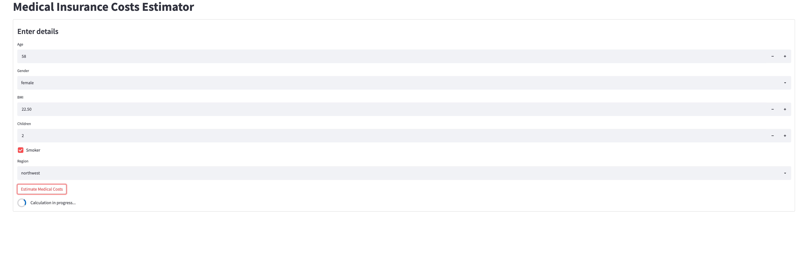

# Machine Learning Using Couchbase

## Running Couchbase

- Couchbase can be run as a Docker container

  `docker run -d -p 8091-8096:8091-8096 -p 11210:11210 --name ml_db couchbase`

- Setting Up

  Access Couchbase Web Console at http://localhost:8091/

  While setting up, enable Analytics, Data, Query and Indexing Service in Couchbase.

  More information on setting up can be found [here](https://docs.couchbase.com/server/current/getting-started/do-a-quick-install.html).

- Import Data using Web Console

  The dataset used here is the [insurance data](https://github.com/stedy/Machine-Learning-with-R-datasets/blob/master/insurance.csv).

  More information on importing data can be found [here](https://docs.couchbase.com/server/current/manage/import-documents/import-documents.html).

- Enabling Python UDFs on Couchbase Analytics

  `docker exec -it ml_db bash /opt/couchbase/bin/couchbase-cli enable-developer-preview -c localhost:8091 -u <username> -p <password> --enable`

## Training the Model

- Install the requirements

  `pip install -r requirements.txt`

- Run the Python script that generates the model `regression_model.pkl` in pipeline.

  `python training_model_insurance.py`

## Packaging the Model

- The machine learning model can be packaged including all the dependencies using [shiv](https://github.com/linkedin/shiv) for any platform. We use Linux here for our container.

  `shiv --site-packages pipeline/ -o pipeline.pyz --platform manylinux1_x86_64 --python-version 39 --only-binary=:all: scikit-learn pandas category_encoders`

- Copy the package into the Couchbase Container
  `docker cp pipeline.pyz ml_db:/tmp/`

## Deploying the Model

- Log in to Docker Container running Couchbase

  `docker exec -it bash`

- Deploy the model into Couchbase Analytics Service

  `cd temp`

  `curl -v -X POST -F "data=@./pipeline.pyz" -F "type=python" "localhost:8095/analytics/library/Default/insurancequote" -u <username>:<password>;`

## Create the User Defined Function in Couchbase Analytics

- Run the User Defined Function Definition in [Couchbase Analytics Query Workbench](https://docs.couchbase.com/server/current/analytics/run-query.html)

  `USE DEFAULT;`

  `CREATE ANALYTICS FUNCTION getInsuranceEstimate(age, sex, bmi, children, smoker, region) AS "quote", "Model.getPrediction" AT insurancequote;`

## Run Machine Learning Inference

- Call the User Defined Function in Analytics Workbench

  `SELECT getInsuranceEstimate(40, "male", 30, 2, "no", "southeast") as quote`

- The output from ML model can be seen on the output window

  `[ { "quote": 7232.8861764099165 } ]`

## Running the Machine Learning Interface using Python App

There is a sample [application](insurance_quote_app.py) written using [Streamlit](https://streamlit.io/) to access the inference using Python.

### Running the Application

- Create a bucket like `insurance-quotes` in Couchbase to store the insurance quotes. Also create the primary index for the bucket so that we can access the data using SQL++ queries.
  `` CREATE PRIMARY INDEX on `insurance-quotes` ``
- The database settings are accessed from a `.env` file. Create a copy of `.env.example` & rename it to `.env` & add the values for the bucket, host name and credentials for your Couchbase cluster.
- Run the application
  `streamlit run insurance_quote_app.py`
- The application can be used to run inference against the model running on Couchbase.
